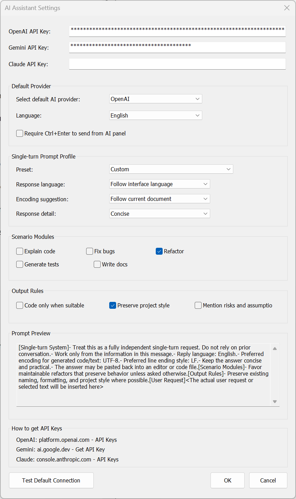
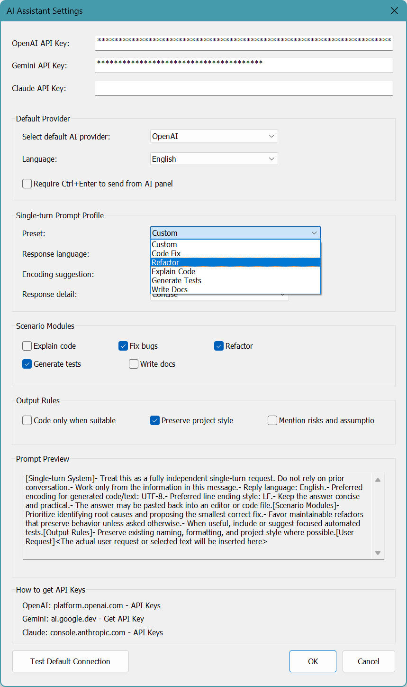
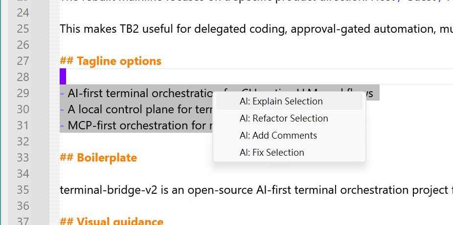

[繁體中文](README_zh-TW.md)

# NppAIAssistant for Notepad++

A lightweight AI assistant plugin for Notepad++ with visible prompts, modular single-turn profiles, and no hidden memory between requests.

This repository is focused on the plugin itself. It does not carry the full Notepad++ source history, which keeps the project easier to publish, review, package, and release.

## Why It Stands Out

- Lightweight plugin architecture instead of a permanent core fork
- Prompt visibility with a live preview of the exact prompt structure
- Single-turn conversations with no hidden cross-request memory
- Dynamic model loading after provider login or API key setup
- Practical context-menu actions for editing workflows
- English and Traditional Chinese UI support

## Core Experience

### Lightweight by design
`NppAIAssistant` ships like a regular Notepad++ plugin. Installation stays familiar, maintenance stays manageable, and release packaging fits the normal plugin ecosystem.

### Prompt visibility
The settings dialog exposes the generated prompt structure. As you switch presets, language, encoding guidance, response detail, scenario modules, or output rules, the preview updates immediately.

### No hidden memory
Each request is treated as a fresh single-turn interaction. The plugin does not depend on chat history as hidden context, which makes behavior easier to audit and easier to predict.

### Editing-first workflow
You can ask through the AI panel or trigger actions directly from the editor context menu for explanation, refactoring, comments, fixes, and related tasks.

## Screenshots

### Prompt preview in settings


### Preset-driven prompt builder


### Context menu actions


## Repository Layout

- `src/` plugin source, resources, version info
- `src/shared/` HTTP, provider API, and secure storage helpers
- `vendor/notepadpp/` vendored plugin and docking headers needed for standalone builds
- `vendor/scintilla/include/` Scintilla headers required by the plugin interface
- `docs/` usage guides, release notes, and submission docs
- `scripts/` install and package helpers

More detail:
- [Project Structure](PROJECT_STRUCTURE.md)
- [Usage Guide](docs/USAGE.md)
- [Plugins Admin Submission Guide](docs/PLUGIN_ADMIN_SUBMISSION.md)

## Build

### Visual Studio / MSBuild

```powershell
& "C:\Program Files (x86)\Microsoft Visual Studio\2022\BuildTools\MSBuild\Current\Bin\MSBuild.exe" "NppAIAssistant.vcxproj" /p:Configuration=Release /p:Platform=x64 /m
```

### CMake

```powershell
cmake -S . -B build
cmake --build build --config Release
```

Expected output:

`build/x64/Release/plugins/NppAIAssistant/NppAIAssistant.dll`

## Install

Copy the built DLL to:

`<Notepad++>\plugins\NppAIAssistant\NppAIAssistant.dll`

Or use:

`scripts/install-npp-ai-plugin.ps1`

## Release and Plugins Admin

The repository already includes packaging and submission helpers for Notepad++ Plugins Admin style releases.

- Packaging script: `scripts/package-npp-ai-plugin.ps1`
- Metadata file: `plugin-admin-metadata.json`
- Submission notes: [docs/PLUGIN_ADMIN_SUBMISSION.md](docs/PLUGIN_ADMIN_SUBMISSION.md)

Recommended release setup:

- GitHub release tag: `v0.1.0`
- Plugin version: `0.1.0.0`
- Release asset: `NppAIAssistant-0.1.0.0-x64.zip`
