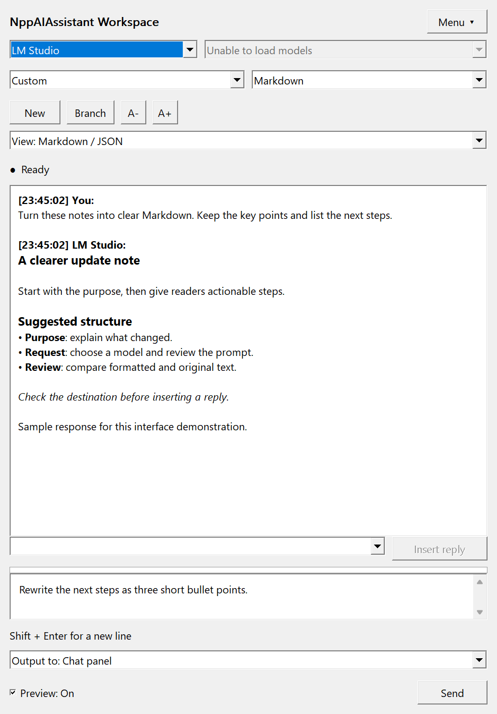
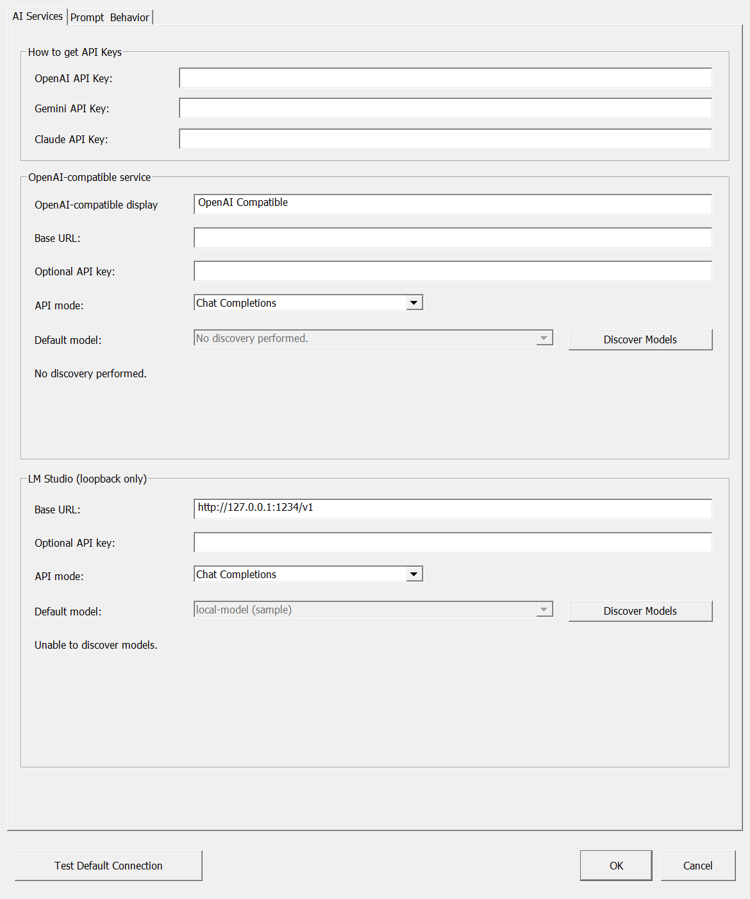
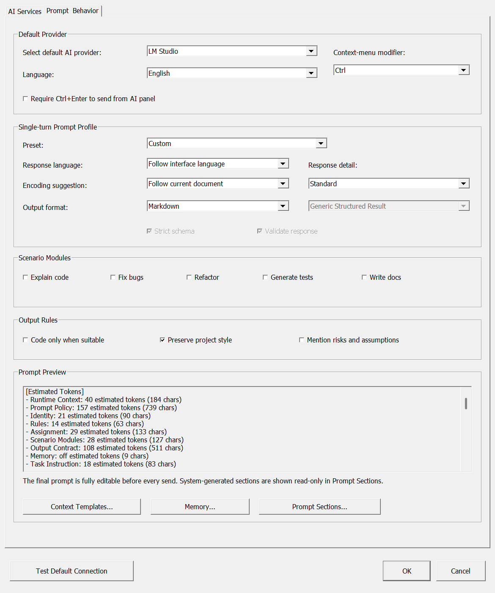

<p align="center">
  
</p>

# NppAIAssistant

**讓 AI 在文字旁協助你。提示看得見，寫入由你決定。**

原生 Notepad++ 外掛，協助解釋程式、改寫文字、整理草稿。你可以選擇雲端 AI 服務，也可以連接本機模型。

[English](README.md) · [下載](https://github.com/pingqLIN/NppAIAssistant/releases/latest) · [回報問題](https://github.com/pingqLIN/NppAIAssistant/issues) · [GPL-3.0](LICENSE)

> **版本說明：**目前已發布的 x64 套件與官方 Plugin List 條目為 **0.1.0.0**（`v0.1.0`）。下方展示的是尚未公開下載的 **0.2.0.6 候選版工作台**。截圖來自獨立 UI 預覽中的真實原生對話框，使用範例內容；不代表即時模型回覆或完整 Notepad++ host 驗收結果。

> **開發原始碼：** OpenRouter 已透過 PR #3 加入 `main`。選取文字後按 Ctrl＋滑鼠右鍵可開啟 AI 選單；一般右鍵與鍵盤選單保留 Notepad++ 原生行為，亦可在設定中完全關閉 AI 右鍵選單。此變更尚未包含於已發布的 v0.1.0。詳見[使用說明](docs/USAGE.md#context-menu-actions)。

## 從提問到完成編輯

1. **選擇服務與模型。**使用雲端 API，或連接本機 LM Studio。
2. **整理這次請求。**選擇任務預設與輸出格式，送出前檢查組合後的提示。
3. **檢視回覆。**切換基本格式預覽與原文，確認內容符合需求。
4. **決定寫入位置。**保留在面板、插入游標、取代選取文字，或建立新文件。

## 認識工作台 · 0.2.0.6 預覽

### 把請求、回覆與輸出位置放在一起



上方選擇服務、模型、任務設定與輸出格式；中間閱讀回覆；下方保留輸出位置和輸入區。可調整面板寬度、拖曳輸入區分隔線，或使用 **A+ / A−** 調整閱讀字級。

| 控制項 | 能幫你完成什麼 |
| --- | --- |
| 送出前預覽 | 檢查即將送往指定服務的完整提示。 |
| 格式預覽／原文 | 閱讀基本 Markdown 或縮排 JSON，同時保留原始回覆。 |
| 輸出位置 | 明確選擇面板、游標、選取文字或新文件。 |
| 回覆選擇 | 選擇要插入文件的那一則 AI 回覆。 |
| 新增／分支對話 | 整理本機對話紀錄；分支不會自動變成模型上下文。 |

### 分開設定連線與任務



設定將服務連線與提示配置分開。LM Studio 有獨立的網址、API 模式與模型選擇：先探索可用模型，再明確選擇預設模型。截圖中的金鑰欄位皆為空白；拍攝環境停用網路，因此模型探索顯示無法載入。

### 知道自己送出了什麼



任務預設、回覆語言、輸出規則與組合提示預覽集中呈現。內建範本區塊預設鎖定，需要明確解鎖才能修改。可見的 Memory 預設關閉，內容以一般本機文字儲存，請勿放入秘密資訊。

## 服務與輸出格式

候選版實作 OpenAI、Gemini、Claude、LM Studio，以及通用 OpenAI 相容服務。模型可用性、存取資格與費用依你選擇的服務而定。Copilot 目前暫停提供。

| 輸出模式 | 候選版行為 |
| --- | --- |
| 文字 | 適合一般編輯、問答與草稿。 |
| Markdown | 面板支援基本標題、強調、程式碼、清單與引用；不渲染 HTML、圖片、連結與表格。 |
| JSON | 要求回覆 JSON；這個模式本身不等於 schema 強制驗證。 |
| 結構化 JSON | 對支援的 OpenAI 與 LM Studio Chat Completions 模型使用原生 schema 傳輸與本機驗證；不支援的路徑會阻擋。 |

請求採非串流方式：狀態列顯示請求階段，完整回應抵達後再顯示答案。**0.2.0.6** 將本機 loopback 生成的**相關 HTTP 階段逾時設為 900 秒**，並非整個請求最多 900 秒；模型探索另用較短逾時。

介面支援英文與繁體中文；日文和西班牙文涵蓋主要工作台，進階設定以英文補足。

## 安裝已發布版本

開啟 **外掛 → 外掛管理**（Plugins Admin），搜尋 **NppAIAssistant**，安裝目前 Notepad++ 清單提供的版本。清單更新抵達各安裝環境的時間可能不同。

若使用 **x64 Notepad++** 手動安裝：

1. 從 [v0.1.0 發布頁](https://github.com/pingqLIN/NppAIAssistant/releases/tag/v0.1.0) 下載 `NppAIAssistant-0.1.0.0-x64.zip`。
2. 關閉 Notepad++，備份既有外掛 DLL。
3. 將 `NppAIAssistant.dll` 解壓至 `<Notepad++>\plugins\NppAIAssistant\NppAIAssistant.dll`。
4. 重新開啟 Notepad++，從 **外掛 → NppAIAssistant** 使用功能。

已發布版本的介面會與上述候選版截圖不同。外掛架構必須與編輯器一致；本頁未提供 x86 或 ARM64 發布套件。

## 隱私與寫入行為

- 請求會把組合提示及其中包含的文字送往你指定的端點；只有服務本身也在本機執行，連接本機網址才代表該請求留在本機。
- 候選版使用 Windows DPAPI 保護 API 憑證，存放於 `%LocalAppData%\Notepad++\AIAssistant`。偏好與可見提示文字存放於 `%AppData%\Notepad++\plugins\config\NppAIAssistant.ini`。
- 使用可攜版 Notepad++，**不會**隔離上述正式版設定路徑。
- 寫入會檢查文件是否改變、是否唯讀，以及編碼是否可無損轉換。套用前請先檢視生成文字；支援的寫入會合併為可復原的編輯動作。
- 請求預設為單輪；畫面中看得到歷史紀錄，不代表每次都會重新傳送先前回覆。

## 建置與參與

需要 Windows、Visual Studio C++ 工作負載與 Windows SDK，以及 CMake 3.21 以上版本。在原始碼目錄執行：

```powershell
cmake -S . -B build -A x64
cmake --build build --config Release
```

輸出路徑依原始碼版本與產生器而定；製作發行 ZIP 時請使用專案封裝腳本。回報問題時，請提供外掛與 Notepad++ 版本、架構、服務／API 模式，以及移除憑證與私人文字的最小重現範例。

[視覺設計說明](docs/VISUAL_DESIGN.zh-tw.md) 記錄原創 AI 生成 Banner 的設計方向及截圖來源。Banner 是專案插畫；功能截圖則來自原生控制項。專案使用 AI 協助開發，採 [GPL-3.0](LICENSE) 授權。
