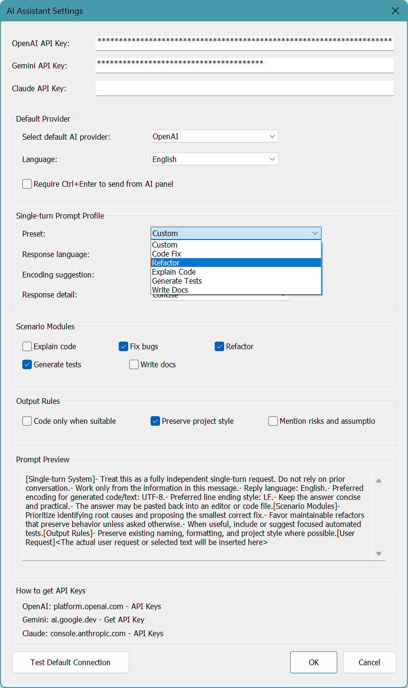
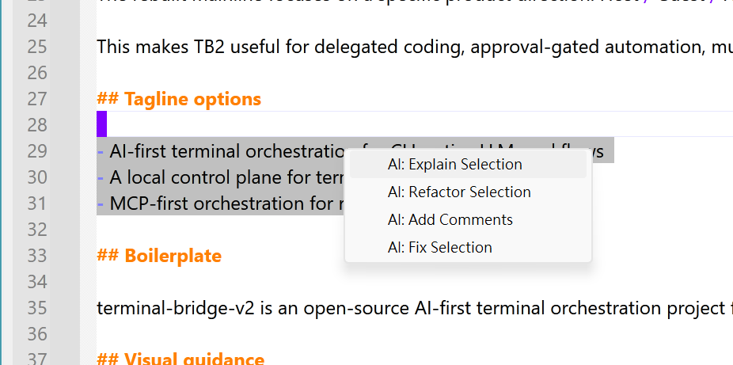

<p align="center">
  <strong>NppAIAssistant</strong><br>
  為 Notepad++ 設計的輕量 AI 外掛
</p>

<p align="center">
  <a href="https://github.com/pingqLIN/NppAIAssistant/releases/tag/v0.1.0"></a>
  <a href="https://github.com/pingqLIN/NppAIAssistant/releases"></a>
  <a href="https://notepad-plus-plus.org/"></a>
  <a href="https://notepad-plus-plus.org/"></a>
  <a href="LICENSE"></a>
  <a href="https://github.com/notepad-plus-plus/nppPluginList/pull/1051"></a>
</p>

<p align="center">
  <a href="README.md">English</a>
</p>

---

強調提示詞可視性、模組化單輪提示設定，以及不保留隱藏記憶的可預測行為。

這個 repository 專注在外掛本身，不攜帶完整 Notepad++ 上游歷史，因此更適合公開發布、程式審查、打包與版本管理。

## 目錄

- [專案亮點](#專案亮點)
- [安全與設定儲存](#安全與設定儲存)
- [截圖](#截圖)
- [建置](#建置)
- [安裝](#安裝)
- [專案結構](#專案結構)
- [發佈與 Plugins Admin](#發佈與-plugins-admin)

## 專案亮點

| 特色 | 說明 |
|------|------|
| **輕量架構** | 以標準 Notepad++ 外掛發佈，不需要 fork 核心 |
| **提示詞可視化** | 設定中即時預覽實際送出的提示結構 |
| **提示詞區塊** | 以可視方式組裝 Mandatory transparency、Identity、Rules、System、Assignment 與 User Request |
| **模板控制** | Identity、Rules、Assignment 模板可編輯、插入 token 並重置 |
| **估算 token 摘要** | 設定預覽顯示各區塊與總量的 estimated tokens |
| **顯示比例** | AI 面板文字比例可透過 `A+` / `A-` 調整並保存 |
| **等待狀態** | Provider 呼叫移出 UI thread，等待時顯示動畫 |
| **明確記憶** | 可選的可視 Memory 區塊預設關閉，並以非機敏設定儲存 |
| **自訂右鍵模板** | 最多三組使用者自訂右鍵 template，可選擇是否取代選取文字 |
| **不保留記憶** | 單輪對話設計，不依賴跨請求隱藏上下文 |
| **動態模型載入** | 登入或設定 API Key 後自動取得可用模型 |
| **更安全的秘密儲存** | 機敏憑證改為本機 DPAPI 保護並支援舊版遷移 |
| **右鍵選單整合** | 常用編輯操作直接融入右鍵功能選單 |
| **雙語介面** | 支援英文與繁體中文 |

## 安全與設定儲存

- API Key 與 OAuth token 儲存在 `%LocalAppData%\Notepad++\AIAssistant`。
- 機敏值使用 Windows DPAPI 保護。
- 一般偏好設定改存於 `%AppData%\Notepad++\plugins\config\NppAIAssistant.ini`。
- 提示詞模板與提示詞區塊偏好屬於非機敏設定。
- 更新後首次啟動會自動遷移舊版 roaming secure blobs。
- Gemini 連線改用 `x-goog-api-key` header，不再把 API key 放進 query string。

## 目前功能邊界

| 項目 | 狀態 |
|------|------|
| 提示詞區塊與 estimated token 預覽 | 已實作 |
| 既有暫停 Copilot 程式碼以外的 OAuth 儲存模型 | 規劃中，尚未驗證 |
| 明確可視 Memory 儲存與注入 | 已實作，預設關閉 |
| 輸出等待動畫 | 已實作 |
| 三組自訂右鍵 template | 已實作 |

## 截圖

### 設定對話框

<table>
<tr>
<td align="center"><strong>提示詞預覽</strong><br><sub>調整 preset 和輸出規則時，即時顯示正在組裝的提示詞</sub></td>
<td align="center"><strong>Preset 驅動的提示組裝</strong><br><sub>切換 preset 快速配置情境模組與回覆參數</sub></td>
</tr>
<tr>
<td></td>
<td></td>
</tr>
</table>

### 右鍵功能選單

直接在編輯器觸發解說、重構、加註解、修正等操作。

<p align="center">
  
</p>

## 建置

<details>
<summary><strong>Visual Studio / MSBuild</strong></summary>

```powershell
.\scripts\invoke-msbuild.ps1 -Configuration Release -Platform x64
```

</details>

<details>
<summary><strong>CMake</strong></summary>

```powershell
cmake -S . -B build
cmake --build build --config Release
```

</details>

預期輸出：`build/x64/Release/plugins/NppAIAssistant/NppAIAssistant.dll`

## 安裝

將編譯出的 DLL 複製到：

```
<Notepad++>\plugins\NppAIAssistant\NppAIAssistant.dll
```

或執行安裝腳本：

```powershell
scripts/install-npp-ai-plugin.ps1
```

## 專案結構

```
NppAIAssistant/
├── src/                  # 外掛主程式、資源檔、版本資訊
│   └── shared/           # HTTP、Provider API、安全與一般設定儲存
├── vendor/
│   ├── notepadpp/        # Notepad++ plugin & docking headers
│   └── scintilla/include # 外掛介面所需的 Scintilla headers
├── docs/                 # 使用說明、發佈說明、提交文件
└── scripts/              # 安裝與打包輔助腳本
```

延伸閱讀：

- [專案結構](PROJECT_STRUCTURE.md)
- [使用說明](docs/USAGE.md)
- [開發紀錄](docs/DEVELOPMENT_LOG.md)
- [安全性修補建議](docs/SECURITY_REMEDIATION.md)
- [安全性驗證清單](docs/SECURITY_VERIFICATION.md)
- [Plugins Admin 提交指南](docs/PLUGIN_ADMIN_SUBMISSION.md)

## 發佈與 Plugins Admin

| 項目 | 路徑 |
|------|------|
| 打包腳本 | `scripts/package-npp-ai-plugin.ps1` |
| Metadata | `plugin-admin-metadata.json` |
| 提交說明 | [docs/PLUGIN_ADMIN_SUBMISSION.md](docs/PLUGIN_ADMIN_SUBMISSION.md) |

建議版本配置：

- GitHub release tag：`v0.1.0`
- 外掛版本：`0.1.0.0`
- Release 資產：`NppAIAssistant-0.1.0.0-x64.zip`

## AI 輔助開發聲明

本專案使用 AI 輔助開發。

| 角色 | Model / 服務 | 貢獻 |
|------|--------------|------|
| 協調者 | OpenAI Codex | 規劃、實作、審查整合、文件更新 |
| 審查者 | OpenAI Codex 子代理 | 安全性、Notepad++ 外掛流程、UI/prompt 架構審查 |

> 免責聲明：AI 產生的變更會透過本機建置、腳本與必要的手動外掛 gate
> 進行審查與驗證，但仍不保證其正確性、安全性或適用於任何特定目的。
> 使用風險自負。

---

<p align="center">
  <sub>GPL-3.0 · <a href="https://github.com/pingqLIN/NppAIAssistant">GitHub</a></sub>
</p>
